# TCP/UDP Server and Client

The TCP Server and Client are two Java programs that enable communication between a server and a client using the TCP/IP protocol. The TCP Server listens for client connections on a specified port, while the TCP Client connects to the server's IP address and port. The server and client exchange data through TCP sockets, allowing for reliable and ordered transmission of messages.

## TCPServer

The TCPServer program represents the server-side of the TCP communication. It creates a server socket and listens for incoming client connections on a specified port. Once a client connects, the server can send and receive messages from the client.


### Code compilation in one go

1. Compile
   ```
   javac Server/*.java
   javac Client/*.java
   ```

2.  Execute

   ```
   java Server/StartTCPServer 9001
   java Server/StartUDPServer 8001

   java Client/StartClient localhost 9001 tcp
   java Client/StartClient localhost 8001 udp
   ```
-------

# Docker Setup

We have also done the docker setup for the project implementation.

## DocKer Installation

Make sure you have docker running on your local computer.

### Usage

To use the UDPServer, follow these steps:

1. Build the docker images for Client, TCP server and UDP server by running the below script:

   ```
   ./build_server_client.sh
   ```

2. To Run the TCP Server, run the below script:

   ```
   ./run_server_tcp.sh
   ```

3. To Run the UDP Server, run the below script:

    ```
   ./run_server_udp.sh
   ```

4. To Run the Unified Client, run the below script:

    ```
   ./run_client.sh <protocol>
   ```
   Protocol will be either `tcp` or `udp`

#Screenshots TCP

## TCP Docker Compilation & Prepopulate

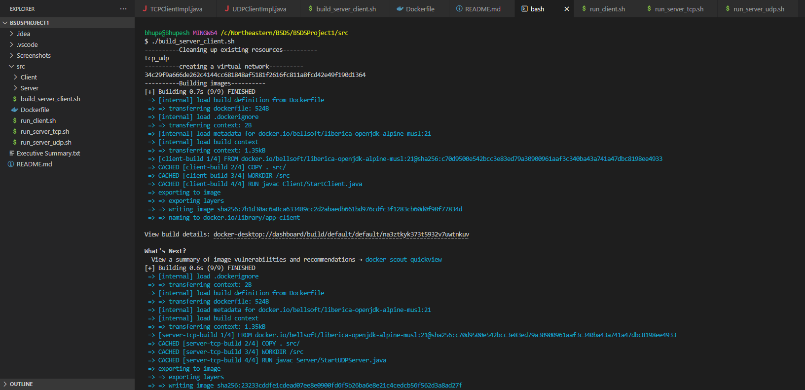

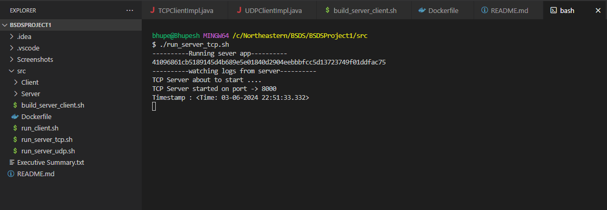

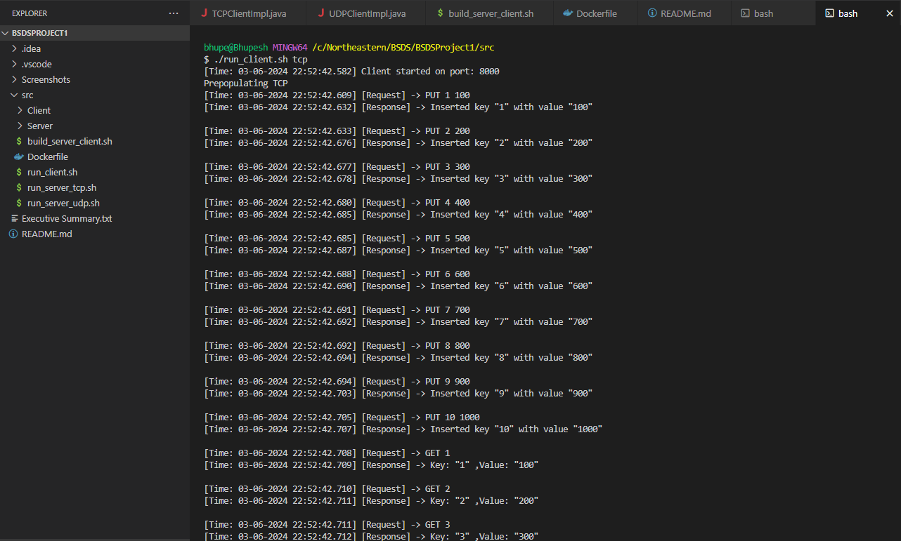

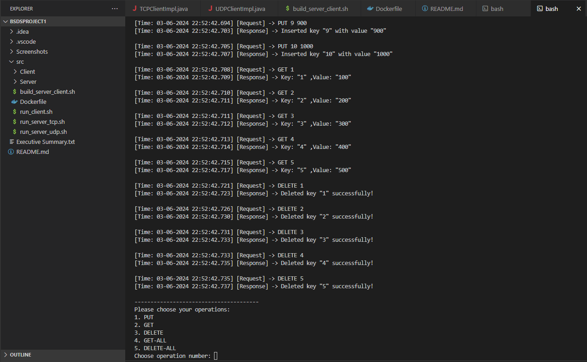

## TCP PUT CLIENT
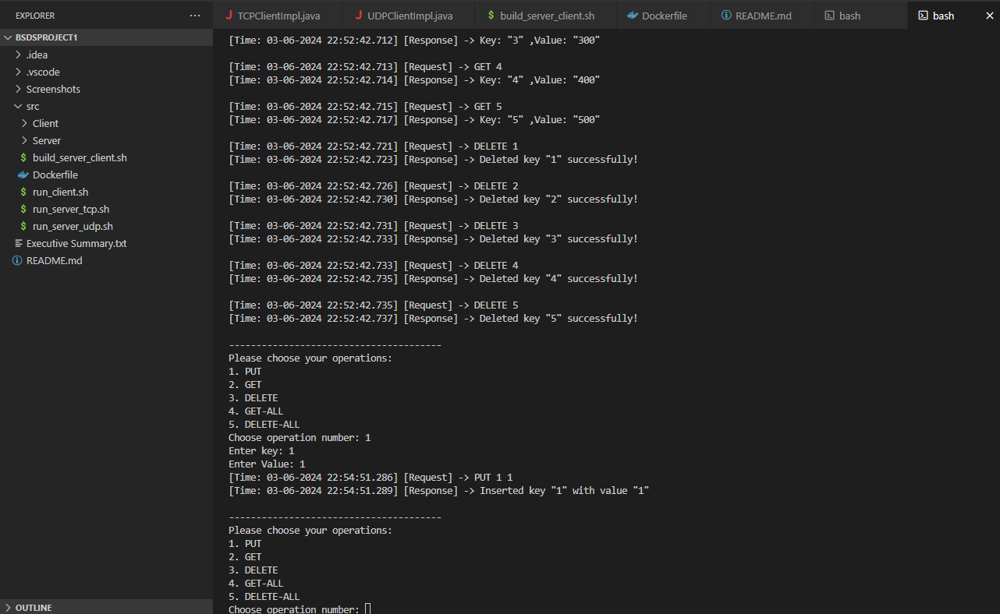

## TCP PUT SERVER
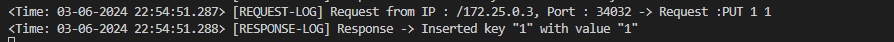


## TCP GET CLIENT


## TCP GET SERVER


## TCP DELETE CLIENT
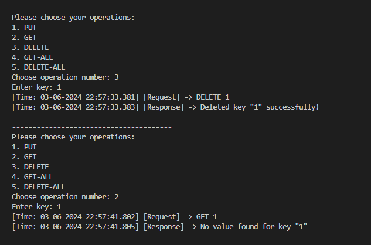

## TCP DELETE SERVER
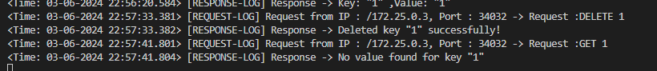

## TCP GET-ALL CLIENT
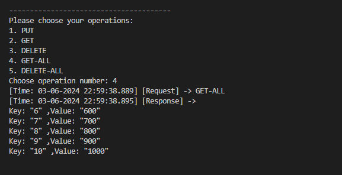

## TCP GET-ALL SERVER
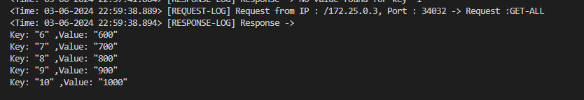

## TCP DELETE-ALL CLIENT
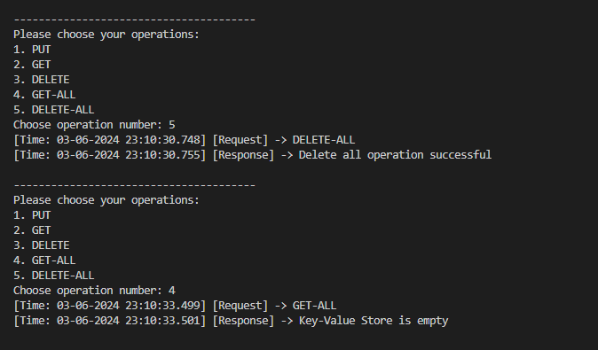

## TCP DELETE-ALL SERVER
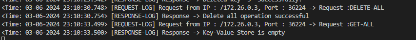

#Screenshots UDP

## UDP Docker Compilation & Prepopulate

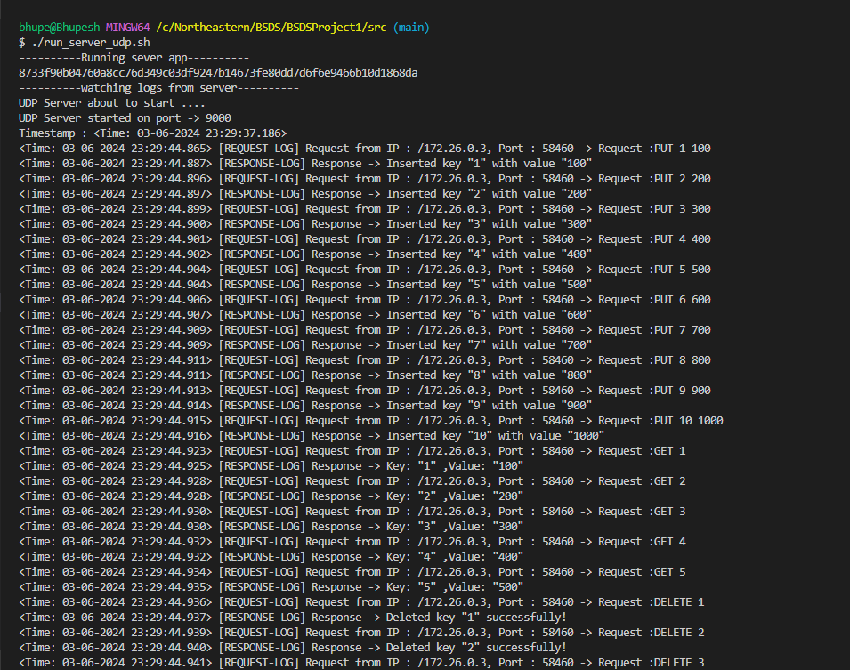


## UDP PUT, GET, DELETE, GET-ALL CLIENT
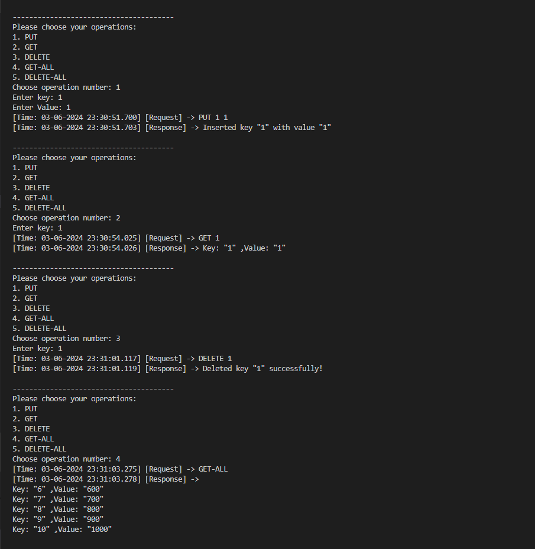

## UDP PUT, GET, DELETE, GET-ALL SERVER
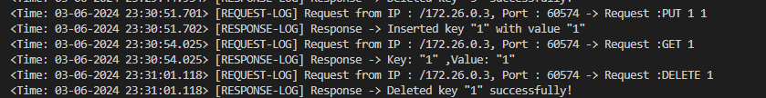

## UDP DELETE-ALL CLIENT
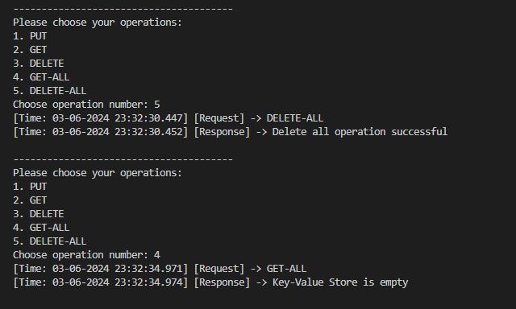

## UDP DELETE-ALL SERVER

